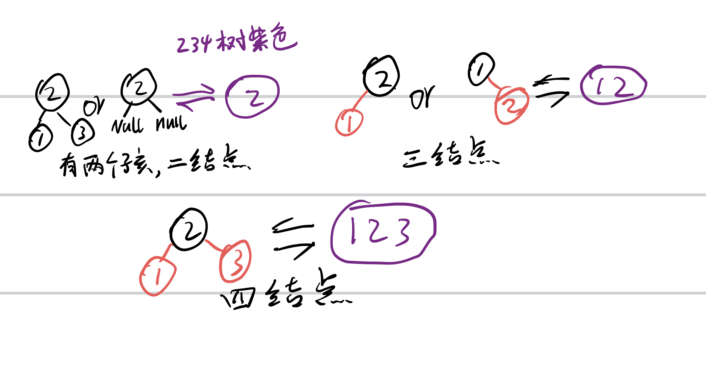
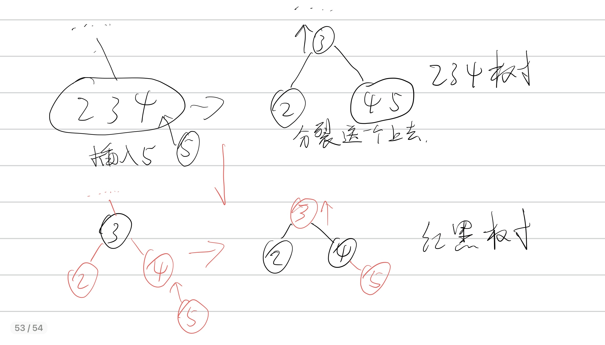
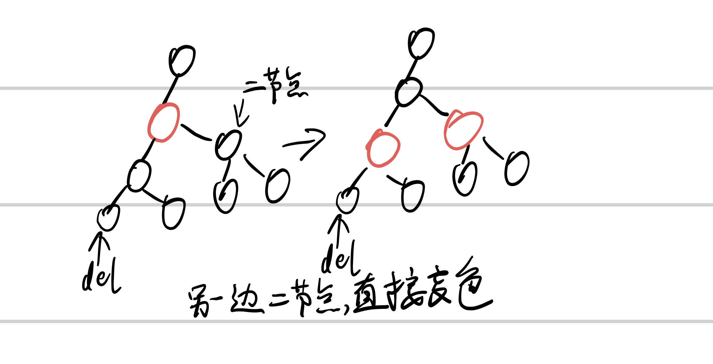
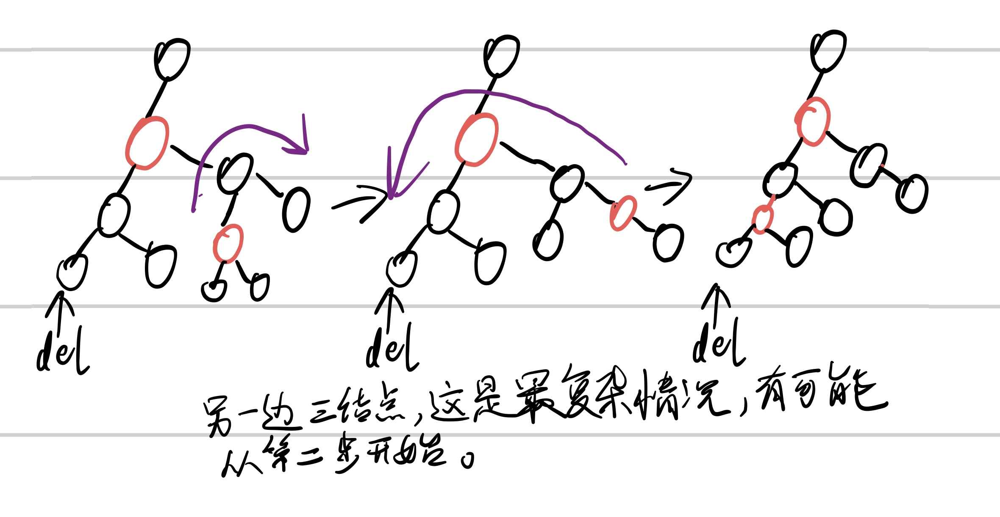
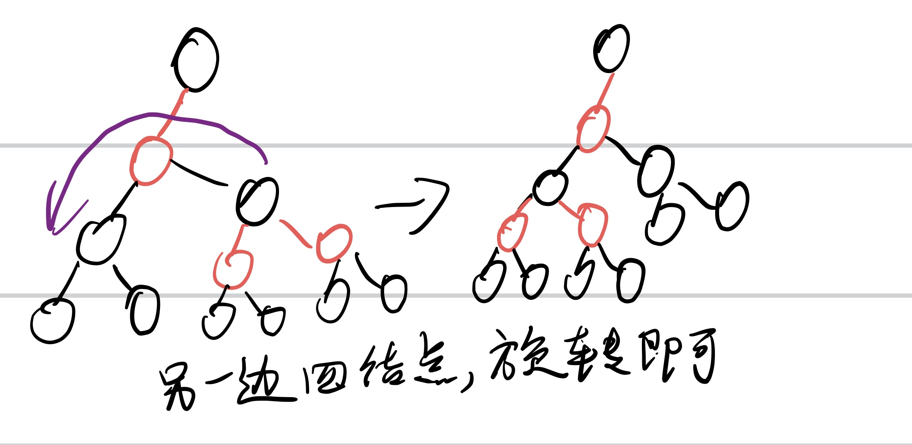
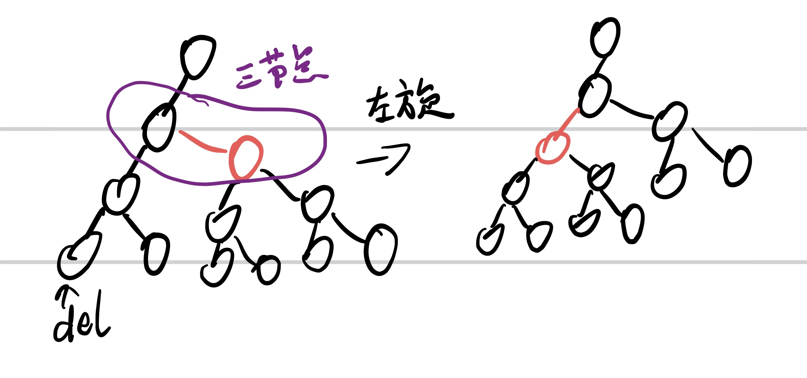
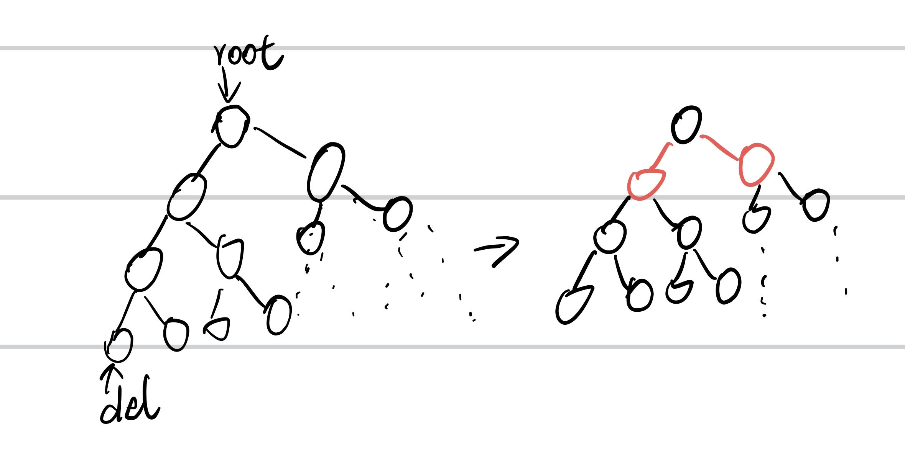
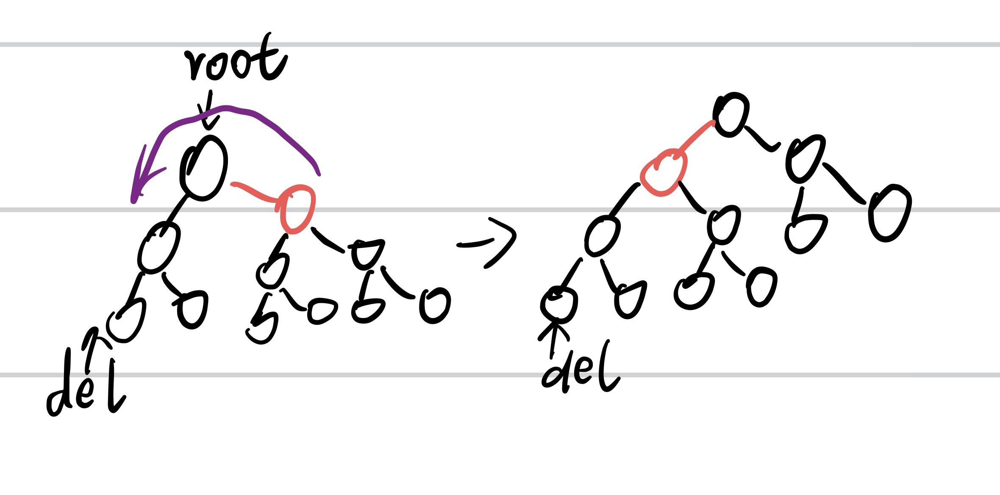
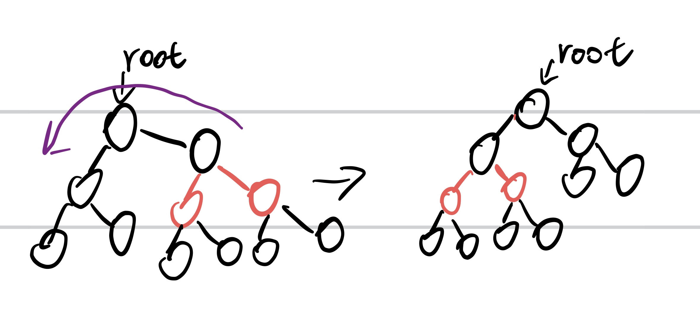
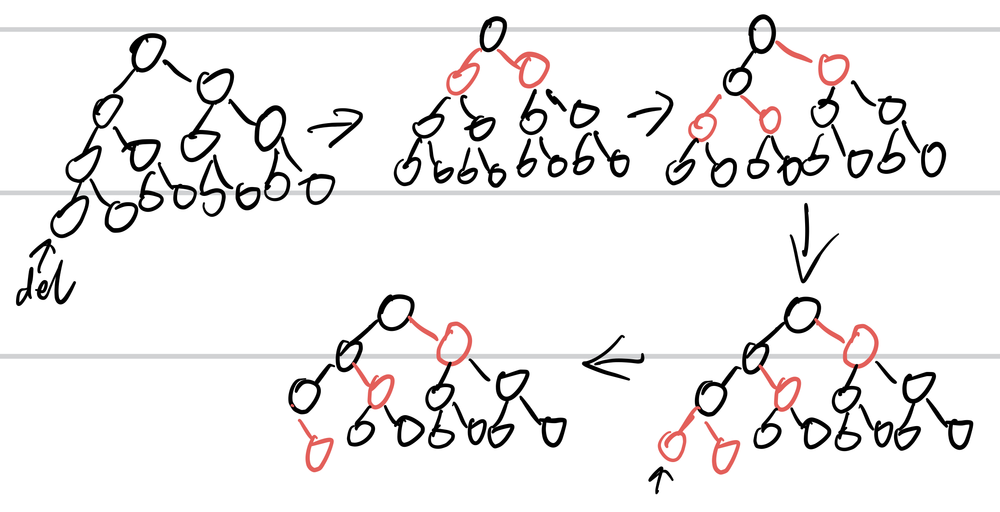

# 红黑树实现小结

红黑树是什么其他人说的比我好，不再赘述。

这里只说一下我实现的时候对难点的一些个人理解。
-  插入的个人理解

红黑树是**234树**的一种实现，234树之所以保持平衡个人理解是：234树将暂时不平衡的情况存储起来，类似于缓存（最大存放三个普通二叉树结点，再多的话就进行***分裂***，分裂时候保持平衡）。234树有三种结点类型，2结点，3结点，4结点。当结点变为4结点（里面是三个普通二叉树结点），再向其中插入新结点。那么这种结构就会分裂开，向上扔出一个“待插入”的结点，向下分裂两个新结点（2结点或3结点，这两个结点相对彼此是平衡的）。所以在局部范围内左右都是平衡的，而升上去的结点，是怎么办？就当新结点插入呗（红黑树中红结点），你看这不就***递归***了。好！要的就是递归，有递归就有规律，就少写代码。

好了插入难点其实就这么多，这个解决了，插入就毫无问题！

- 删除的个人理解

**删除的最简单情况提一下，如果找到替代删除的结点是红色，直接删除。**

但找到替代删除的结点是黑色呢？？特别复杂，相信网上绝大多数讲红黑树的压根都不讲这个问题，我不知道他们是不会还是懒的讲。

我对红黑树删除的理解是基于对插入的理解的（**删除可以看作是插入的逆向操作**）。***插入的特点是将二结点构造成三结点，三结点构造成四结点。四结点再插入就裂开！***

而删除就是从待删除结点（为二结点为黑色）往上找，找到把该结点变红的方法，**找到四结点变成三结点，找到三结点变成二结点，找到二结点再往上.......**红黑树里表现就是**往上找红色**，把红色变黑，把待删除结点变红。然后就可以直接删除了！

那这个情况就比较多了，在我眼里分两中情况，一种就是**一直找到根结点情况**，还有就是只是**找到待删结点的祖先有红色出现**。

下面会给出删除案例，只有一边的情况，对称的情况没有画出来。画出来的都是一般案例，而不是特殊的案例。过程是由**一个指针从待删除结点往上寻找符合条件的祖先结点。**每一步操作**并非做完就戛然而止，而是递归的。**做完后从下面再往上寻找（前一步修改过树结构，后面行动肯定不一样），直到待删结点为红色！待删结点以del标识出来。

**一. 祖先结点非根。**

1.寻找过程发现祖先是红结点。

- 从del往上寻找，如果找到祖先为红色，就去看红色另一边是什么结点，这里是二结点，直接变色。然后再从del结点重新往上寻找。然后就会出现下面的情况，找到祖先为红色，另一边为二结点.........

- 最复杂的单步变化，需要旋转两次，如果直接判断是第二部，就只要旋转一次。做完再从下往上，寻找做变化。这里最后的情况符合上面第一个案例。

- 发现祖先是红色，另一边是四结点，直接旋转变色，然后再从下往上寻找作变化。这里最后又符合第一个案例。

**二. 过程发现祖先是黑结点，但不是二结点。**

- 除了发现祖先结点是红色的，祖先结点是黑色，但是三结点也需要发生变化。但这种情况直接旋转就好，接下来交给其他情况处理。

**三.  一直找到了根结点，也没发现除二结点以外的结点。**

- 下面情况是处理一种奇怪的情况，假如红黑树全都是黑色的，关键还平衡，那么就会跳到根结点停止，直接在根结点作变化。

- 假如根结点另一边是二结点，直接变色！！！那么问题来了，为啥上面案例不能变色处理，还向上找呢？答案是：因为这个特权只有根结点拥有，如果非根结点也这么作，就会发现黑色不平衡（因为所有结点都需要向上交代，保持跟自己的兄弟一样，到叶子结点黑色个数相同）。而根结点不需要向上交代！！

- 假如根结点自己是二结点。直接旋转就好了，类似把红结点往待删除的那一边转移，这样有可以套娃交给别的操作了。

- 根结点另一边三结点类似，直接旋转即可。

**给一个有点极端但简单的案例，相信你们一看就会了，其他操作也不过按规则来的！**

### 最后贴上自己的一份实现，完全自己根据理解实现，毕竟别人的代码我也看不懂，也懒得看懂。

https://github.com/jhc-hcw/red_black_tree.git
